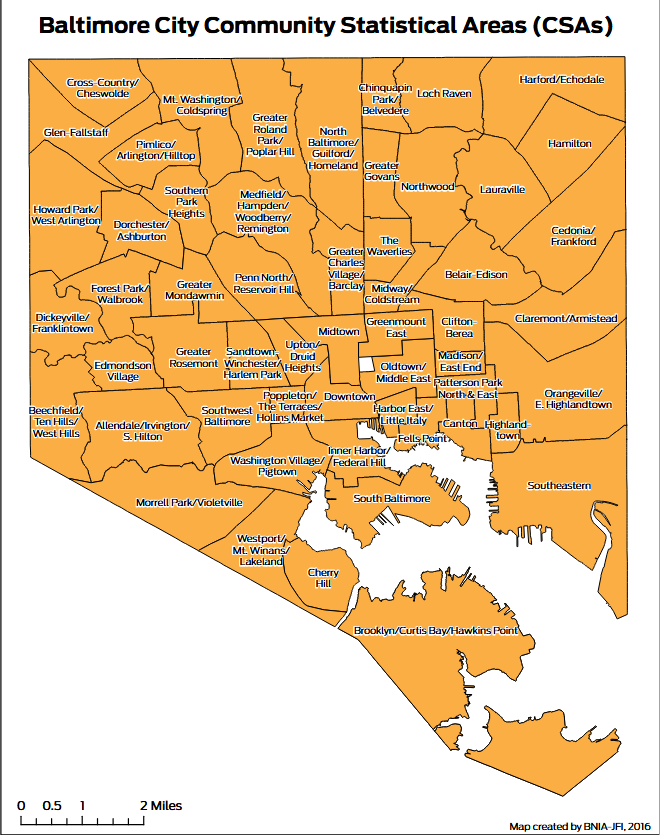

# BaltCityRealEstate
Data Science using Baltimore City publicly available real estate-related data

We will focus on a few key metrics to analyze real estate in Baltimore City:
* Home sales prices - yearly trends
* Home rent prices - yearly trends
* % owner occupied housing
* % rental housing
* Vacant residential housing
* % employed, and median salary
* % unemployment

As part of this, we will do this analysis at the:
* Census tract to bring in census data
* Community Statistical Area as developed by BNIA

Map of CSAs in Baltimore City:

https://vital-signs-bniajfi.hub.arcgis.com/search?tags=housing

Testing VS Code editing - does this get updated on GitHub?